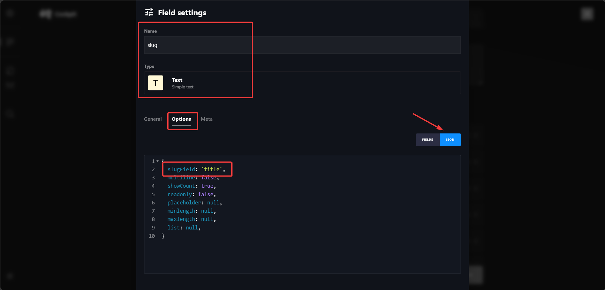
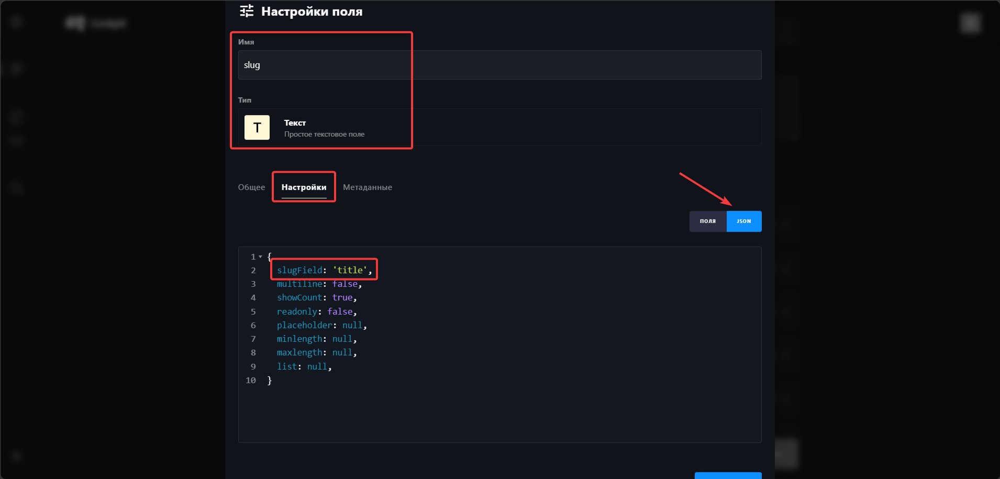

# cockpit-simple-slug

[🇬🇧 English](#english) | [🇷🇺 Русский](#русский)

---

## English

Project: Cockpit CMS helper script

This repository provides a compact PHP helper for Cockpit CMS that generates URL-friendly, unique slugs from configured text fields. It performs Cyrillic→Latin transliteration for Russian, normalizes strings (lowercase, replaces non-alphanumeric characters with dashes) and resolves collisions by appending numeric suffixes.

---

### Functionality

- Generate a slug from a configured source text field when an item is created or updated
- Support for Russian transliteration (Cyrillic -> Latin)
- Ensure slug uniqueness within the collection by appending numeric suffixes on collisions
- Works with singletons and collections and respects Cockpit locales (adds locale suffixes)
- Uses Cockpit's storage API to check for existing slugs

---

### Installation

Copy the file or paste the code into your Cockpit project's `config/bootstrap.php`. The script listens to content save events and will generate slugs when items are created or updated.

---

### Setup

Make sure you have a field (type = `text`) named `slug` in your collection and in the field's options add a JSON key `slugField` with the value of the field you want to generate the slug from. Example:

```
slugField: 'title',
```



---

### License

This project is licensed under the [GNU Affero General Public License v3 (AGPLv3)](https://www.gnu.org/licenses/agpl-3.0.html).

---

### Contacts

Author: Yuriy Plotnikov

Website: https://yuriyplotnikovv.ru

---

## Русский

Проект: Скрипт для Cockpit CMS

Этот репозиторий содержит небольшой PHP-скрипт для Cockpit CMS, который автоматически генерирует удобные для URL уникальные слаги (slug) из настроенных текстовых полей. Скрипт включает транслитерацию для русского (кириллица) и базовую обработку конфликтов имен.

---

### Функциональность

- Генерация slug из указанного текстового поля при создании или обновлении записи
- Поддержка транслитерации для русского языка (кириллица -> латиница)
- Обеспечение уникальности slug в коллекции (при совпадении добавляется числовой суффикс)
- Работает с singletons и collections, учитывает локали Cockpit (добавляет суффиксы локалей)
- Использует API хранилища Cockpit для проверки существующих slug

---

### Установка

Скопируйте файл или вставьте код в ваш `config/bootstrap.php` в проекте Cockpit. Скрипт подписывается на событие сохранения контента и выполняет генерацию slug при создании и обновлении записей.

---

### Настройка

Убедитесь, что в вашей коллекции есть поле (type = `text`) с именем `slug`, и в опциях этого поля добавлен JSON-ключ `slugField` со значением поля, из которого нужно генерировать slug. Пример:

```
slugField: 'title',
```



---

### Лицензия

Проект распространяется под лицензией [GNU Affero General Public License v3 (AGPLv3)](https://www.gnu.org/licenses/agpl-3.0.html).

---

### Контакты

Автор: Yuriy Plotnikov

Сайт: https://yuriyplotnikovv.ru

